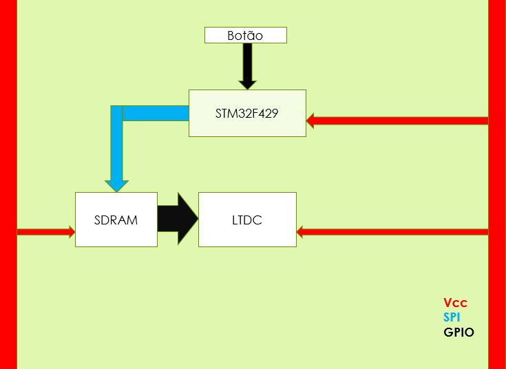

# Leitor de Livros em BMP 

Implementação de um leitor de livros utilizando a tela LCD da Discovery STM32F429.

### Conceito e Motivação
A presença dos livros digitais está cada vez mais presente no cotidiano das pessoas. Como na música, é mais prático levar um leitor de livro digital com vários livros na memória do que levar os livros físicos. 
Este projeto consiste da implementação inicial de um leitor de livros, utilizando a Discovery STM32F429 para armazenamento dos livros em BMP, exibição das páginas na tela LCD e será usado o botão de usuário para passar as páginas do livro.

### Pinagem
Todos os periféricos utilizados foram internos à placa Discovery STM32F429.

### Fluxograma do Firmware

### Diagrama de Blocos

### Referências

[datasheet-STM32F429][DataSheet-stm32f429]

[ManualUser-STM32F429][Manual do usuário - stm32f429]

